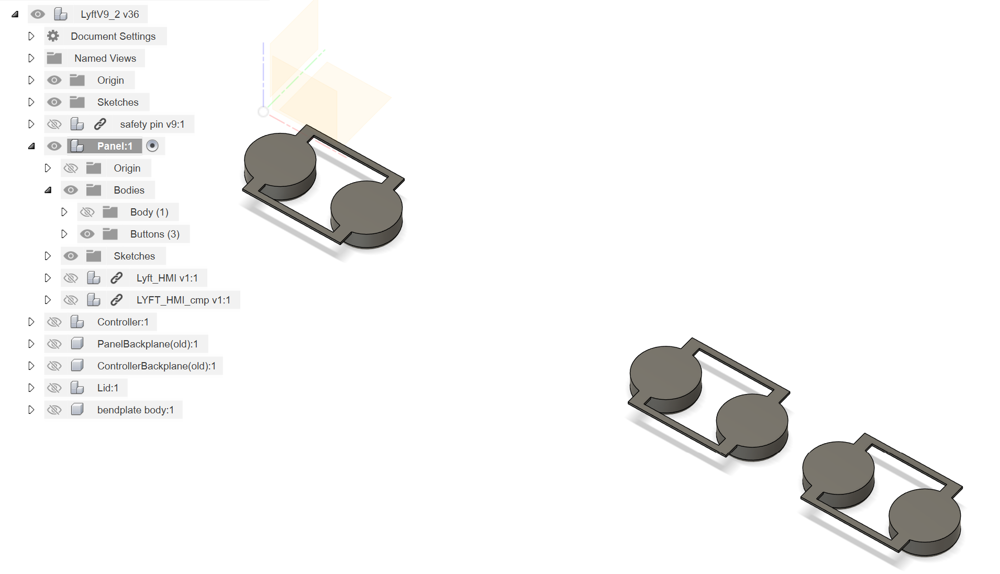

# LyftV9_2 v36 (R1.00.00)

The slicer file was made for the Prusa mk3s+. 

## Print Part Combinations
### Main Body

- Component "Panel"
  - Body Group
- Component "Controller"
  - all bodies except "fastener"
  - exclude Component "Levers"
- Component "bendplate body"

### Lid

- Component "Lid"

### Levers

- Component "Levers" in "Controller"
  - hide everything else

### Buttons

- Body Group "Buttons" in "Panel"
  - hide everything else

### Fasteners

- Body "fastener" in "Controller"
  - hide everything else

